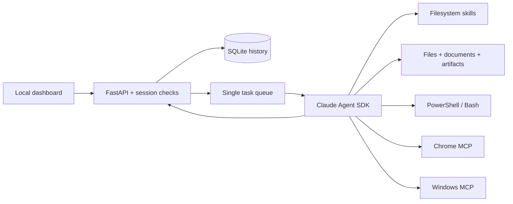

# Architecture

The browser dashboard submits a task to a local FastAPI server. The server records it in SQLite and queues it. One worker creates a Claude Agent SDK session, discovers installed skills and registered tools, and streams observations/results back as durable events. Claude decides the next action from the user's instruction, skills and current tool observations.

## Responsibilities

- `config.py`: data/workspace locations, settings, starter skills, atomic configuration writes.
- `auth.py`: locate the official CLI, inspect native sign-in metadata, remove billing overrides from this process. Never reads credential files or copies tokens.
- `store.py`: conversations, jobs, ordered events, file records, interrupted-job recovery.
- `agent.py`: SDK session lifecycle, permissions, streaming, requests for user input, cancellation, task serialization and terminal results.
- `tools.py`: general task-independent file/document/command/output capabilities.
- `connectors.py`: local stdio MCP processes and platform readiness checks. Browser tools are available on Mac and Windows; desktop tools are Windows-specific.
- `skills.py`: safe skill package import and editable Markdown. Skills are context, not new executable privileges.
- `app.py`: local authenticated HTTP API, SSE, uploads and downloads.
- `instance.py`: OS file lock preventing two CLI instances from operating the same data folder.
- `static/`: plain HTML/CSS/JS interface; no simulated production executor is selectable here.

## Decisions and tradeoffs

**Local Python service:** matches the existing Python-heavy environment, works on Mac and Windows, and can run native desktop processes in the user's session. Deployment is a source folder plus virtual environments rather than a signed installer executable.

**Claude SDK first:** implements the requested tool-using agent without recreating the model loop. File/browser/desktop tools are separate capabilities; another inference engine could be introduced later. There is no unimplemented provider selector pretending to support other models today.

**One task at a time:** protects one interactive desktop from competing jobs. Jobs in other conversations queue. A second task in an already-busy conversation is rejected. Scaling requires separate worker sessions, not extra concurrent mouse controllers.

**Resume is explicit:** session IDs support follow-up context. A server restart marks incomplete jobs interrupted and does not replay them. On a user follow-up, the agent must inspect external state before repeating writes. There is no universal exactly-once transaction guarantee for third-party browser operations.

**Ask/autonomous per task:** general file tools and skill reading operate directly. Ask mode pauses for commands and most browser/desktop actions; autonomous mode delegates them for that task. Commands have account-level access, so these are interaction controls, not an OS sandbox. Native `Read` is checked against allowed roots with a pre-tool hook; built-in Bash/Write/Edit are not exposed. Windows-MCP's duplicate command/filesystem/registry/process tools are excluded so Clara's chosen file/command tools remain the primary path.

**Separate Windows environment:** Windows-MCP has native OS and its own MCP/server dependencies. Keeping them out of the main SDK environment reduces version collisions. Its actual Windows Server behavior remains a target-platform acceptance item.

**Dedicated Chrome profile:** allows persistent website sessions without copying personal Chrome cookies. Chrome must be installed. Browser connector availability does not prove a website is authenticated or controllable.

**Local session security:** 127.0.0.1 binding, strict Host/Origin checks, same-site HttpOnly cookie, local bootstrap token, custom header on state-changing requests, content security policy and no permissive CORS. This is not multiuser portal authentication. The token is a local dashboard capability, not a model credential.

## Failure behavior

- Missing/expired subscription login: mark the task failed and retain the model error; do not switch to API billing.
- Missing enabled connector: actionable failure instead of silently downgrading the requested capability.
- Unusable Windows input desktop: reject desktop-enabled execution before model work. An accessible desktop still needs a screenshot/action test.
- Uncertain third-party result: agent instructions require checking existing state before retries. Firm-specific idempotency rules belong in the later verified workflow integration.
- Stop/timeout: cancel the SDK execution, close its context and terminate spawned command process trees. Completed actions and published output snapshots remain visible.
- Restart: retain history and mark incomplete work interrupted. No unattended action replay.

## Remaining engineering work

Prove live model execution after login; test actual browser and native Windows behavior; add firm-approved skills; connect portal identity/tasks/attachments; establish the supported billing route; then evaluate retries and correctness against a representative test set. Server deployment needs an interactive-session launch strategy tested against that server's RDP policies. Mac backend tests cannot establish this.

## Version 0.2.0 extension

The current implementation and boundaries are described in [PRODUCTION-IMPLEMENTATION.md](PRODUCTION-IMPLEMENTATION.md). `records.py` adds workflow, evidence, knowledge, memory, operation and portal tables without rewriting prior history. `production_tools.py` exposes shared capabilities; `production_api.py` provides authenticated operator review. `windows_bridge.py` wraps the pinned Windows MCP runtime. Chrome and native desktop availability are independent: a missing optional connector is omitted and reported instead of rejecting all task execution. `portal.py` implements an outbound, operator-bound assignment/result protocol, disabled until configured.

Screenshot evidence now lives separately from text events under the data/evidence directory. Diagnostics exports include IDs and checks but no screenshot bytes. `backup.py` uses SQLite backup and excludes model/browser account state. A successful SDK result cannot mark an incomplete configured workflow complete; operator review is a separate recorded step.
